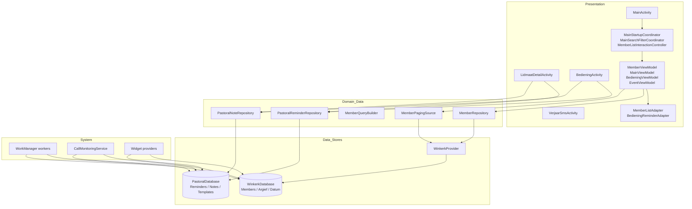
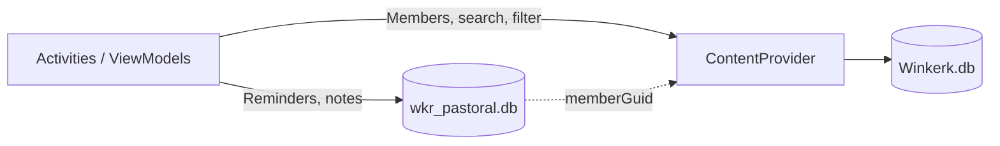
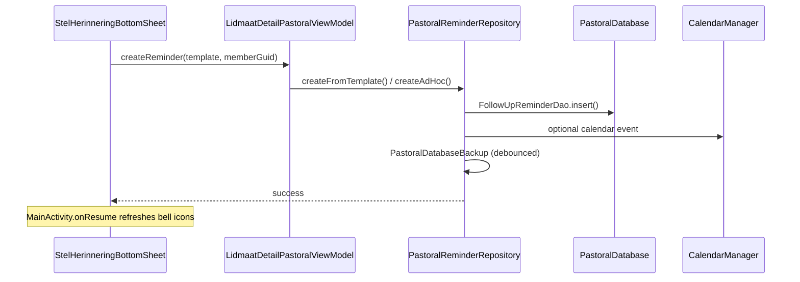

# WinkerkReader — Architecture & Program Flow

> Technical reference for developers. Package root: `app/src/main/kotlin/za/co/jpsoft/winkerkreader/`  
> Last updated: 2026-06-28

---

## Table of contents

1. [System overview](#1-system-overview)
2. [Layer diagram](#2-layer-diagram)
3. [Dual-database model](#3-dual-database-model)
4. [Application startup flow](#4-application-startup-flow)
5. [MainActivity & member list flow](#5-mainactivity--member-list-flow)
6. [Search, filter & sort flow](#6-search-filter--sort-flow)
7. [Member detail flow](#7-member-detail-flow)
8. [Pastoral / Bediening flow](#8-pastoral--bediening-flow)
9. [Widget flows](#9-widget-flows)
10. [Database sync flow](#10-database-sync-flow)
11. [Call monitoring flow](#11-call-monitoring-flow)
12. [Background workers](#12-background-workers)
13. [Class interconnection map](#13-class-interconnection-map)
14. [Key file index](#14-key-file-index)

---

## 1. System overview

WinkerkReader is a congregation member management app for Android. It combines:

| Subsystem | Purpose | Primary entry |
|-----------|---------|---------------|
| **Member list** | Browse, search, filter, sort members | `MainActivity` |
| **Member detail** | View/edit member, family, milestones | `LidmaatDetailActivity` |
| **Pastoral CRM** | Follow-up reminders, notes, templates | `BedieningActivity`, bottom sheets |
| **Data sync** | Import/update congregation DB | `LaaiDatabasisActivity`, workers |
| **Widgets** | Birthdays/milestones + pastoral reminders | `WinkerkReaderWidgetProvider`, `PastoralWidgetProvider` |
| **Communication** | SMS, WhatsApp, call logging, caller ID | `VerjaarSmsActivity`, services |

**Tech stack:** Kotlin · ViewModel + LiveData/Flow · Paging 3 · Room · ContentProvider · WorkManager · Foreground services

---

## 2. Layer diagram



---

## 3. Dual-database model

The app intentionally uses **two separate SQLite databases**:

### Congregation database (`Winkerk.db`)

| Aspect | Detail |
|--------|--------|
| **Access path** | `ContentResolver` → `WinkerkProvider` → Room `WinkerkDatabase` |
| **Contract** | `data/WinkerkContract.kt` |
| **Tables** | Members, Adresses, Groepe, Argief, Datum, … |
| **Why ContentProvider?** | Legacy compatibility, raw SQL query modes, widget/service access |

### Pastoral database (`wkr_pastoral.db`)

| Aspect | Detail |
|--------|--------|
| **Access path** | Direct Room — `PastoralDatabase.getInstance()` |
| **Contract** | Room entities/DAOs under `data/pastoral/` |
| **Tables** | `follow_up_reminders`, `pastoral_notes`, `reminder_templates`, `template_steps`, `pastoral_meta` |
| **Link to members** | `memberGuid` (UUID string) resolved via `MemberGuidResolver` |



---

## 4. Application startup flow

### 4.1 Cold start (process create)

```
WinkerkReader.onCreate()
└── AppInitializer.initializeApp()
    ├── DatabaseInitializer.initializeDatabase()     [first launch only]
    ├── CallMonitoringService.startForegroundService() [if enabled]
    ├── WorkScheduler.scheduleAll()
    │   ├── DropboxDownloadWorker
    │   ├── BirthdayReminderWorker
    │   ├── WidgetRefreshWorker
    │   └── FollowUpReminderWorker
    └── PastoralWidgetProvider.refreshWidgets()
```

**Key files:** `WinkerkReader.kt`, `utils/AppInitializer.kt`, `utils/WorkScheduler.kt`, `data/DatabaseInitializer.kt`

### 4.2 MainActivity startup

```
MainActivity.onCreate()
├── PastoralBackupWorker schedule/cancel (SettingsManager)
├── ActivityMainBinding + initializeViews()
│   └── MemberListAdapter + RecyclerView (lidmaatList)
├── ActivityResultCoordinator (search/filter result launchers)
├── AppAuthGuard.guardIfNeeded()
│   └── onAuthenticated → MainStartupCoordinator.runOnCreate()
│       ├── PermissionManager checks/requests
│       ├── AppInitializer.initialize(onReady → loadInitialData())   ← single load when DB ready
│       ├── startMonitoringServiceIfEnabled()
│       ├── setupViewModel()        ← paging observers, coordinators
│       ├── setupPermissions()      ← notification channels
│       ├── setupEventHandlers()
│       └── checkNotificationAccessInBackground()
├── BackPressHandler (filter cancel / finish)
└── loadPendingReminderGuids()      ← pastoral bell icons on list
```

**Key files:** `MainActivity.kt`, `MainStartupCoordinator.kt`, `AppAuthGuard.kt`

### 4.3 First data load (`loadInitialData`)

Called **once** from `AppInitializer.onReady` when the congregation DB is available:

```
loadInitialData()
├── initializeData()               ← sort order from SettingsManager.defLayout
├── searchFilterCoordinator.refresh()
│   └── MemberViewModel.loadData(mode)
│       ├── Updates paging StateFlows (if query changed)
│       └── OR currentPagingSource.invalidate() (same query → keeps scroll)
├── WhatsAppContactLoader.loadWhatsAppContactsAtomic()
└── loadChurchInfoAndUpdateHeader()
```

---

## 5. MainActivity & member list flow

### 5.1 Component responsibilities

| Class | Role |
|-------|------|
| `MainActivity` | Host activity; wires coordinators, observers, lifecycle |
| `MemberViewModel` | Paging flow, sort/search/filter state, row counts |
| `MemberListAdapter` | `PagingDataAdapter<MemberItem>` — compact/detailed rows |
| `MainSearchFilterCoordinator` | Resolves query mode, drives `loadData()` |
| `MemberListInteractionController` | Popup menu, long-press tag, pastoral bottom sheets |
| `MainMenuController` | Options menu, SearchView, active/inactive filter |
| `MemberListScrollHelper` | Saves/restores scroll position across navigation |

### 5.2 Paging pipeline

```
MemberViewModel.pagingDataFlowWithRefresh
├── combine(_sortOrder, _soek, _recordStatus, _filterList, _eventType)
├── flatMapLatest { params → Pager { MemberPagingSource(...) } }   ← new Pager only when params change
└── cachedIn(viewModelScope)

MainActivity.setupViewModel()
└── repeatOnLifecycle(STARTED)
    └── collect { pagingData → memberListAdapter.submitData(lifecycle, pagingData) }
```

**Refresh without scroll jump:**

```
MemberViewModel.refresh()
└── currentPagingSource?.invalidate()
    └── MemberPagingSource.getRefreshKey()  ← anchor-based offset for SQL LIMIT/OFFSET paging
```

**Scroll preservation on return from detail:**

```
MainActivity.onPause()
└── MemberListScrollHelper.saveScrollState(lidmaatList)

MainActivity.onResume() / loadState NotLoading / pending GUID update
└── MemberListScrollHelper.restoreScrollState()
```

### 5.3 List row interaction

```
User taps row
└── MemberListInteractionController.showMemberPopupMenu()
    ├── kyk_lidmaat_detail → MemberActionHandler → MemberUtils.openMemberDetail()
    ├── bel / SMS / WhatsApp / epos → MemberActionHandler
    ├── voeg_nota_by → VoegNotaByBottomSheet
    └── stel_herinnering → StelHerinneringBottomSheet

User long-presses row
└── MemberListInteractionController.onMemberLongClick()
    └── ContentResolver.update(LIDMATE_TAG) → observeDataset() if changed
```

### 5.4 Pending reminder icons on list

```
MainActivity.onResume()
└── loadPendingReminderGuids()
    └── PastoralDatabase.followUpReminderDao().getAllPending()
        └── MemberViewModel.updatePendingRemindersSet(guids)
            └── MemberListAdapter.updatePendingReminderGuids(guids)
                └── rebindVisibleItems() only (no full notifyItemRangeChanged)
```

---

## 6. Search, filter & sort flow

### 6.1 Query modes (`MainQueryMode`)

| UI label / `defLayout` | `MainQueryMode` | SQL event type |
|------------------------|-----------------|----------------|
| VAN | Surname | `LIDMAAT_DATA` |
| GESINNE | Family | `GESINNE_DATA` |
| ADRES | Address | `LIDMAAT_DATA_ADRES` |
| VERJAAR | Birthday | `LIDMAAT_DATA_VERJAAR` |
| HUWELIK | Wedding | `HUWELIK_DATA` |
| OUDERDOM | Age | `OUDERDOM_DATA` |
| WYK | Ward | `LIDMAAT_DATA_WYK` |
| SOEK_DATA | Search | `SOEK_DATA` |
| FILTER_DATA | Filter | `FILTER_DATA` |

Resolution: `MainSearchFilterCoordinator.resolveQueryMode(layout)`

### 6.2 Search flow

```
SearchView.onQueryTextChange (debounced 300ms)
└── MainSearchFilterCoordinator.performSearch(query)
    ├── viewModel.soek = query; viewModel.soekList = true
    ├── settingsManager.defLayout = "SOEK_DATA"
    └── refresh() → loadData(Search)
        └── MemberQueryBuilder.buildQuery(eventType=SOEK_DATA, soek=query)
```

### 6.3 Filter flow

```
Menu → Filter OR inline FilterHandler panel
└── ActivityResultCoordinator.onFilterResult(filterList)
    └── MainSearchFilterCoordinator.applyFilterResult()
        ├── Saves previous sort in MainViewModel.savedSortOrderBeforeFilter
        ├── viewModel.sortOrder = "Filter"; defLayout = "FILTER_DATA"
        └── loadData(Filter(filterList))
```

Cancel filter (`BackPressHandler` / `cancelFilter()`):

```
restore savedSortOrder → loadData(restored mode) → clear filter state
```

### 6.4 Sort flow (swipe / menu)

```
Swipe left/right OR MenuItemHandler.handleVerjaar/handleGesinne/…
└── MainActivity.updateSortOrder(newSort)
    ├── settingsManager.defLayout = newSort
    ├── MemberViewModel.sortOrder = newSort  → _sortOrder StateFlow → new Pager
    └── observeDataset() → searchFilterCoordinator.refresh()
```

**NavigationHandler** (legacy swipe helper) and **MenuItemHandler** both ultimately call `MainActivity.observeDataset()`.

---

## 7. Member detail flow

```
MemberUtils.openMemberDetail(context, MemberItem)
└── Intent → LidmaatDetailActivity
    ├── EXTRA_MEMBER_GUID
    ├── Content URI (_rowid_)
    └── RECORD_STATUS

LidmaatDetailActivity.onCreate()
├── LidmaatDetailViewModel          ← member, family, milestones via ContentProvider
├── LidmaatDetailPastoralViewModel  ← reminders + notes via PastoralDatabase
├── BedieningSeksieController       ← pastoral section UI (rvHerinneringe, rvNotas)
└── MainNavigationController        ← navigate to related family members

Pastoral actions from detail
├── StelHerinneringBottomSheet → PastoralReminderRepository.createFromTemplate()
├── VoegNotaByBottomSheet → PastoralNoteRepository.insert()
└── Photo pick → PhotoHelper / ContentResolver update
```

**Return to MainActivity:** `MainActivity.onPause()` saved scroll; list is **not** fully reloaded unless member data changed via tag/long-press off-screen.

---

## 8. Pastoral / Bediening flow

### 8.1 Create reminder



### 8.2 Vandag dashboard

```
MainActivity menu → BedieningActivity
└── ViewPager2 + BedieningPagerAdapter
    └── BedieningVandagFragment
        ├── BedieningViewModel.observeVandagDashboard()
        │   └── PastoralReminderRepository → FollowUpReminderDao
        └── BedieningReminderAdapter
            ├── Complete → repository.complete()
            ├── Snooze → repository.snooze()
            └── Tap member → LidmaatDetailActivity

MainViewModel.pendingReminderCount → options menu badge on MainActivity
```

### 8.3 Notifications

```
WorkManagerHelper.scheduleFollowUpReminders()
└── FollowUpReminderWorker (daily ~07:00)
    └── PastoralNotificationHelper.showReminderNotification()
        └── PastoralReminderActionReceiver (Complete / Snooze action)
            └── PastoralReminderRepository
            └── Optional: Intent → BedieningActivity (deep link reminder id)
```

### 8.4 Template management

```
BedieningActivity / Settings menu
├── TemplateManagerActivity → TemplateManagerViewModel
└── TemplateEditorActivity → edit ReminderTemplateEntity + TemplateStepEntity
    └── ReminderTemplateDao / seeded by PastoralDatabaseInitializer
```

---

## 9. Widget flows

### 9.1 Birthday / milestone widget

```
Schedule: WorkScheduler → WidgetRefreshWorker (daily)
      OR WinkerkReaderWidgetProvider AlarmManager (01:00:01)
      OR manual refresh (widget_image3 tap)

WinkerkReaderWidgetProvider.onUpdate()
├── RemoteViews (widget.xml)
├── setRemoteAdapter → ListViewWidgetService
│   └── WidgetViewsFactory.onDataSetChanged()
│       └── WidgetDataRepository.refreshCache()
│           └── WinkerkDatabase + WidgetQueryBuilder.buildCombinedQuery()
│               └── Verjaar, Doop, Huwelik, Belydenis, Sterf (SettingsManager toggles)
└── PendingIntent template → row click
    └── VerjaarSmsActivity (birthday list / SMS)
    └── MainActivity (header icon)
```

### 9.2 Pastoral widget

```
PastoralWidgetProvider.onUpdate()
├── PastoralWidgetRemoteViewsService
│   └── Factory → FollowUpReminderDao.getAllPending()
├── Click root → BedieningActivity
├── Click left icon → MainActivity
└── Click refresh icon → ACTION_REFRESH_PASTORAL_WIDGET

Refreshed after: reminder CRUD, AppInitializer, WidgetRefreshWorker, repository writes
```

---

## 10. Database sync flow

```
LaaiDatabasisActivity (manual) OR DropboxDownloadWorker / FileDownloadWorker (scheduled)
├── Download/copy Winkerk.db (+ optional photos)
├── contentResolver.call(CONTENT_URI, "reloadDatabase")
│   └── WinkerkProvider → WinkerkDatabase invalidation
├── WidgetDataRepository.invalidateCache()
└── User returns to MainActivity → observeDataset() / refresh
```

**Pastoral backup (separate):**

```
PastoralBackupWorker (daily, SettingsManager.dailyBackupEnabled)
└── PastoralDatabaseBackup.export()
    └── Downloads or app files dir

MainActivity.checkForNewerBackup()
└── Snackbar → restore via LaaiDatabasisActivity flow
```

---

## 11. Call monitoring flow

```
CallMonitoringService (foreground)
├── PhoneCallMonitor / TelephonyCallback (API 31+)
│   └── CallerInfoResolver → ContentProvider phone lookup
│       └── OproepDetailService overlay (if enabled)
├── UnifiedCallMonitor
│   └── WhatsAppNotificationService (NotificationListener)
│       └── VoIP call state from Notification.CallStyle
└── CalendarManager (optional call log to calendar)

DeviceBootReceiver → reschedule alarms + restart service if enabled
CallLogActivity → display/export call history
```

---

## 12. Background workers

| Worker | Schedule | Triggered by | Effect |
|--------|----------|--------------|--------|
| `WidgetRefreshWorker` | Daily ~06:00 | `WorkScheduler` | Refresh birthday + pastoral widgets |
| `FollowUpReminderWorker` | Daily ~07:00 | `WorkScheduler` | Pastoral due notifications |
| `PastoralDailyDigestWorker` | Daily | `WorkScheduler` | Digest notification |
| `PastoralBackupWorker` | Daily | `MainActivity` if enabled | Export pastoral DB |
| `DropboxDownloadWorker` | Configurable | `WorkScheduler` | Download congregation DB |
| `FileDownloadWorker` | On demand | `LaaiDatabasisActivity` | File transfer completion |
| `PhotoDownloadWorker` | Periodic | `WorkScheduler` | Member photo sync |
| `BirthdayReminderWorker` | Daily | `WorkScheduler` | Birthday SMS alarm (partial/stub) |

---

## 13. Class interconnection map

### 13.1 MainActivity delegation tree

```
MainActivity
├── MainStartupCoordinator        → AppInitializer, loadInitialData, permissions
├── MainSearchFilterCoordinator   → MemberViewModel.loadData, query modes
├── MemberListInteractionController → popup menus, VoegNotaBy, StelHerinnering
├── MainMenuController            → SearchView, filter checkboxes, observeDataset
├── ActivityResultCoordinator     → search/filter Activity Results
├── MainNavigationController      → all activity Intents
├── MainDataLoader                → church header (legacy helper)
├── MemberListScrollHelper        → scroll save/restore
├── BirthdayScrollHelper          → scroll to next birthday (VERJAAR sort)
├── AppAuthGuard                  → biometric lock overlay
├── BackPressHandler              → filter cancel
├── MenuItemHandler               → sort menu items → observeDataset
└── PermissionManager             → runtime permissions
```

### 13.2 ViewModel dependencies

| ViewModel | Reads from | Writes to | Used by |
|-----------|------------|-----------|---------|
| `MemberViewModel` | WinkerkProvider (paging), MemberRepository | ContentProvider (via UI actions) | MainActivity, VerjaarSmsActivity |
| `MainViewModel` | PastoralDatabase (counts), SavedStateHandle | SettingsManager sort restore state | MainActivity, BackPressHandler |
| `LidmaatDetailViewModel` | ContentProvider | ContentResolver.update | LidmaatDetailActivity |
| `LidmaatDetailPastoralViewModel` | PastoralDatabase | PastoralReminderRepository, PastoralNoteRepository | LidmaatDetailActivity, bottom sheets |
| `BedieningViewModel` | PastoralReminderRepository | Repository complete/snooze | BedieningActivity, BedieningVandagFragment |
| `EventViewModel` | ContentProvider (raw SQL) | — | VerjaarSmsActivity |
| `ArgiefViewModel` | ContentProvider (Argief) | — | ArgiefListActivity |
| `TemplateManagerViewModel` | ReminderTemplateDao | Template CRUD | TemplateManagerActivity |

### 13.3 Utility hub (`SettingsManager`)

Almost every subsystem reads/writes `SettingsManager` (singleton SharedPreferences):

- Sort default (`defLayout`), widget toggles, call monitor flags
- Church names/colours, list display columns
- SMS templates (`VerjaarBoodskap`, …), backup preferences
- Database initialized flag, biometric app lock

---

## 14. Key file index

### Application & startup
| File | Path |
|------|------|
| Application | `WinkerkReader.kt` |
| App init | `utils/AppInitializer.kt` |
| DB bootstrap | `data/DatabaseInitializer.kt` |
| Startup coordinator | `ui/activities/MainStartupCoordinator.kt` |

### Member list
| File | Path |
|------|------|
| Main screen | `ui/activities/MainActivity.kt` |
| ViewModel | `ui/viewmodels/MemberViewModel.kt` |
| Paging source | `data/MemberPagingSource.kt` |
| Query builder | `data/MemberQueryBuilder.kt` |
| Repository | `data/MemberRepository.kt` |
| Adapter | `ui/adapters/MemberListAdapter.kt` |
| Scroll helper | `ui/activities/MemberListScrollHelper.kt` |
| Search/filter | `ui/activities/MainSearchFilterCoordinator.kt` |

### Congregation data
| File | Path |
|------|------|
| Contract | `data/WinkerkContract.kt` |
| Provider | `data/WinkerkProvider.kt` |
| Room DB | `data/room/WinkerkDatabase.kt` |

### Pastoral CRM
| File | Path |
|------|------|
| Room DB | `data/pastoral/PastoralDatabase.kt` |
| Reminder repo | `data/pastoral/repository/PastoralReminderRepository.kt` |
| Note repo | `data/pastoral/repository/PastoralNoteRepository.kt` |
| Dashboard UI | `ui/activities/BedieningActivity.kt` |
| Fragment | `ui/fragments/BedieningVandagFragment.kt` |
| Set reminder sheet | `ui/bottomsheets/StelHerinneringBottomSheet.kt` |
| Add note sheet | `ui/bottomsheets/VoegNotaByBottomSheet.kt` |

### Widgets
| File | Path |
|------|------|
| Birthday widget | `widget/WinkerkReaderWidgetProvider.kt` |
| Widget list service | `services/ListViewWidgetService.kt` |
| Widget data | `widget/WidgetDataRepository.kt` |
| Pastoral widget | `widget/PastoralWidgetProvider.kt` |

### Navigation & actions
| File | Path |
|------|------|
| Navigation | `utils/MainNavigationController.kt` |
| Member actions | `utils/MemberActionHandler.kt` |
| Open detail | `utils/MemberUtils.kt` |

---

## Related documentation

| Document | Contents |
|----------|----------|
| `project_context.md` | Product overview, features, directory summary |
| `android_best_practice_analysis.md` | Code quality review & modernization status |
| `pastoral_crm_phase1_spec.md` | Pastoral CRM Phase 1 specification |
| `pastoral_crm_sprint_*.md` | Sprint B–E feature specs |
| `obsolete_code_analysis.md` | Legacy/dead code inventory |
| `parameterised_queries_plan.md` | SQL parameterization migration |
